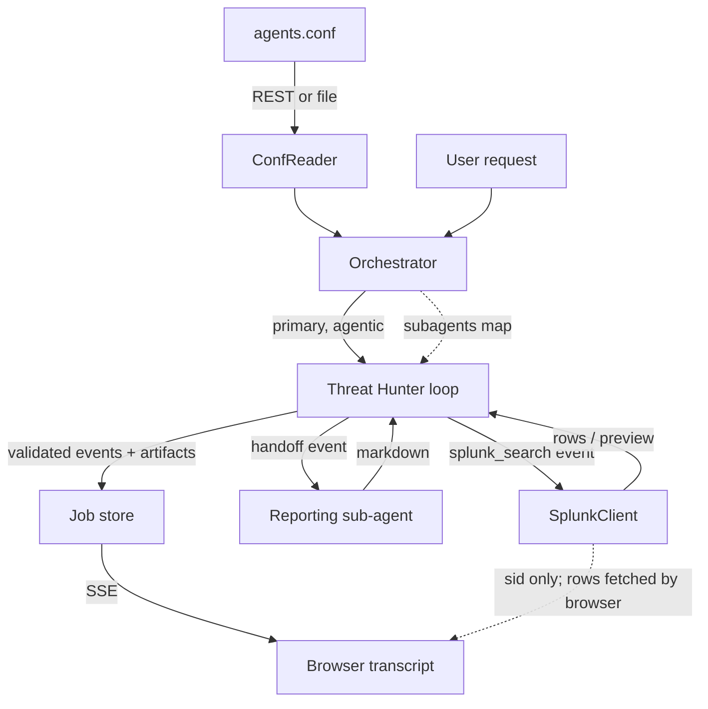

# Splunk Agent Mesh — Architecture

## Conceptual model

Splunk Agent Mesh is an agentic SOC investigation copilot. The product is
centered on **one user-visible agent — the Threat Hunter** — that investigates
an alert by reasoning, searching Splunk, and reporting. Agents are still defined
as configuration (`agents.conf` stanzas), but the shipping mesh is deliberately
focused: a single `primary` agent plus one internal `subagent`.

The Threat Hunter communicates exclusively through a **structured event
stream**. It never emits free prose to the user — it returns a JSON object whose
`events` array the harness validates, renders, and acts on.



### Primary agents vs. sub-agents

- A **primary** agent (`agent_role = primary`) is user-visible and appears in
  the transcript. Today that is just `spl_hunter` ("Threat Hunter").
- A **subagent** (`agent_role = subagent`) is a delegated internal capability,
  invoked only by a primary agent via a `handoff` event and never shown as a
  peer. Today that is `executive_brief` ("Reporting").
- The orchestrator runs only primary agents top-level and passes a lookup of
  sub-agents to the agentic agent.
- Five legacy SOC agents (`triage`, `timeline`, `blast_radius`,
  `detection_gap`, `response`) remain in `agents.conf` as `enabled = 0` — kept
  for easy revival, not run.

## The structured event contract

The Threat Hunter returns **valid JSON only**: `{"events": [ {type, title, text,
payload}, ... ]}`. Event types:

| Type | Purpose | Notable payload |
|---|---|---|
| `narration` | High-level explanation of the current step | — |
| `splunk_search` | A proposed/executed SPL query | `query`, `purpose`, `type` (viz hint) |
| `result_summary` | Summary of search or sub-agent results | — |
| `finding` | A security-relevant observation | structured fields (user, src_ip, confidence, …) |
| `handoff` | Delegate to a sub-agent | `sub_agent`, `task` |
| `final` | Closing user-facing answer | `summary`, `recommended_actions` |

Validation lives at the LLM boundary in `agents/events.py` (pydantic
`EventsEnvelope`/`AgentEvent`). It parses strictly, tolerates a single
surrounding ```` ```json ```` fence, and on any failure returns the corrective
message **"Remember to always respond with json."** The UI only ever receives
validated events.

## The harness loop

`agents/agentic_llm_agent.py` (`AgenticLLMAgent`) drives the investigation. It
is **provider-agnostic**: it calls `LLMProvider.complete()` and parses the JSON
itself — it does not use any vendor tool-use API.

```
messages = [system_prompt, user_request]
for iteration in range(max_iterations):
    response = llm.complete(messages)
    events, corrective = parse_and_validate(response)
    if corrective:
        append assistant(response) + user("Remember to always respond with json.")
        continue
    record events
    action = last event if its type is splunk_search or handoff else None
    if action is splunk_search: run SPL, append results, loop
    elif action is handoff:     run sub-agent, append its output, loop
    else:                       stop (final / informational terminal)
# if the budget ran out mid-action: one finalize turn, then a synthetic final
```

Key properties:

- **One external action per turn**, taken from the *last* event. This prevents
  the model from queuing a blind chain of dependent searches.
- **Handoff** runs the named sub-agent (`executive_brief`), feeds its markdown
  back into the conversation, and asks the Threat Hunter to summarize it as a
  `result_summary` + `final`. The sub-agent's raw output never reaches the UI.
- **Finalize turn + synthetic final**: if `max_iterations` is hit while an
  action is still pending, the harness makes one closing call ("you're out of
  budget, summarize now"); if even that yields no terminal event, it appends a
  harness-authored `final` so the stream never dangles.

## Search execution and artifacts

A `splunk_search` event's `payload.query` is executed by
`tools/splunk_search.py::run_splunk_search_artifact`, which produces an
**artifact** dict (`fields`, `rows`, `sid`, `visualization`, `_revision`).

- **Progressive results**: `SplunkClient` dispatches the job, then polls;
  preview rows stream back through an `on_update` callback. Each update bumps
  the artifact's `_revision`, the job store upserts the artifact by id, and the
  SSE loop re-emits it — so a search card animates pending → running → done.
- **Visualization**: `payload.type` is a hint (`timechart | table | column |
  line | pie | single`; `column` aliases `timechart`). `infer_visualization`
  honors the hint first, then falls back to SPL/data-shape heuristics.

## Frontend architecture

**Framework**: React 18 + TypeScript. **UI**: `@splunk/react-ui` v5,
styled-components, `@splunk/themes`. **Charts**: `@splunk/visualizations`
(Column, Line, Pie). **Markdown**: `react-markdown` + `remark-gfm` +
`rehype-sanitize` (used for final-summary text and the legacy fallback).

The component library is `@splunk/agent-mesh-ui`; the Splunk app
`@splunk/agent-mesh` mounts `<Investigations />`. Top-level nav has three tabs
(Investigation / Settings / About).

### Investigation flow

1. The analyst fills the form and clicks Start.
2. `POST /investigations/start` returns an id **and a `stream_token`**.
3. The page opens `GET /investigations/{id}/stream?stream_token=…` (SSE).
4. As events arrive (`agent_update` / `agent_complete`), the transcript reveals
   them one at a time (`useStaggeredReveal`) and auto-follows the bottom unless
   the analyst has scrolled up.
5. For each `splunk_search` artifact, the browser polls Splunk Web directly for
   preview and final rows and renders the chart inline. (The backend does not
   return rows — see Security.)

### Component hierarchy

```
Investigations
└── InvestigationPage              (form, start, SSE, browser result polling)
    ├── FormCard
    └── InvestigationReport        (console workspace)
        ├── Toolbar                (title + Clear)
        ├── AgentHead              (agent name + status badge)
        └── TranscriptShell
            ├── ScrollArea         (staggered reveal, stick-to-bottom autoscroll)
            │   ├── EventRenderer × N   (colored accent blocks per event type)
            │   ├── ArtifactRenderer    (inline chart/table after each search event)
            │   └── ThinkingIndicator   (while the agent is working)
            └── StatusBar          (investigation state, hunter state, event count, id)
```

## Backend architecture

**Framework**: Python FastAPI on uvicorn, port 8765.
**Conf source**: `SplunkRestConfReader` reads agent stanzas via
`/servicesNS/nobody/splunk-agent-mesh/configs/conf-agents`; `FileConfReader` is
the dev/test fallback when `SPLUNK_TOKEN` is absent.
**Job execution**: `InvestigationJobStore` runs investigations in a thread pool
and the SSE endpoint streams progress.

### Orchestrator

`Orchestrator.run()` reads all enabled agents, splits them into `primary` and
`subagent` sets, executes only the primary agents, and hands the sub-agent
lookup to the agentic agent. A `primary` agent with `agent_mode = agentic` runs
through `AgenticLLMAgent`; a `single_shot` agent runs through the generic
`LLMAgent` (and the legacy `depends_on` DAG / fenced-SPL post-processing path
still exists for such agents, though none ship enabled today).

### SSE streaming

`/api/v1/investigations/{id}/stream` emits:

- `agent_order` — once, the list of primary agent ids.
- `agent_update` — an in-progress snapshot of the agent's events + any
  newly-revised artifacts.
- `agent_complete` — the agent's terminal snapshot.
- `investigation_complete` — when the run finishes.
- `error` — on stream/job error.

Artifacts are re-emitted whenever their `_revision` increases, so the browser
sees live search progress. The endpoint requires a valid `stream_token`.

## How React talks to the backend

Inside Splunk Web the React app sends JSON API requests through the
Splunk-authenticated **`agent_mesh_bridge`** custom REST endpoint
(`bin/agent_mesh_bridge.py`, exposed via `restmap.conf` + `web.conf`). Splunk
Web proxies these under `/<locale>/splunkd/__raw/services/…`; the bridge
forwards them to `http://127.0.0.1:8765/api/v1` with the authenticated Splunk
username and session key. Direct uvicorn calls remain available for explicit
development use.

The SSE stream connects directly to uvicorn with the short-lived signed
`stream_token` returned by `/start` (EventSource cannot send headers).

## How the backend talks to Splunk

- **Conf reading**: `SplunkRestConfReader` reads agent stanzas via REST.
- **Search execution**: `SplunkClient` submits searches with the delegated
  user's session key (auth scheme `Splunk`), emits the SID, polls, streams
  preview rows, and returns final rows to the harness for the next LLM turn.
- **Browser chart data**: React polls `results_preview` and `results` through
  Splunk Web's authenticated `splunkd/__raw` proxy using `@splunk/splunk-utils`
  (`services/splunkSearchResults.ts`).
- **Session validation**: before a live run, the backend calls
  `/authentication/current-context` to confirm the session is valid and matches
  the requesting user.
- **Credential storage**: `SplunkSecureSettingsStore` (Passwords API) — stubbed;
  `DevSettingsStore` is used in the current deployment.

## How the backend talks to LLM providers

All LLM calls go through `LLMProvider.complete(messages, model, temperature,
max_tokens)`. Anthropic is the active provider; OpenRouter and OpenAI-compatible
adapters implement the same interface. Because the agentic loop is built on
`complete()` (not vendor tool-use), every provider works without special-casing.

## Security posture

- **Delegated per-request auth**: live investigations require the analyst's
  Splunk session, validated and matched to the requesting user. The service
  `SPLUNK_TOKEN` is only a fallback, gated behind
  `AGENT_MESH_ALLOW_SERVICE_SEARCH_FALLBACK=1`.
- **Row minimization**: `public_artifact` / `public_investigation` strip search
  rows from API responses; the browser fetches rows itself via Splunk Web's
  authenticated proxy. Demo artifacts keep their rows (no real search job).
- **Signed SSE tokens**: `stream_tokens.py` issues short-lived HMAC tokens
  (default 4h). The secret is per-process (regenerated on restart) — acceptable
  for the current single-process deployment; see `docs/legacy/HISTORY.md` for
  the tradeoff.
- **Output safety**: the model boundary accepts only validated JSON events;
  markdown rendered in the UI is sanitized via `rehype-sanitize`.

## Known risks

1. **CORS**: the backend needs the Splunk Web origin allowlisted (default
   includes `http://localhost:8000`).
2. **In-memory job state**: `InvestigationJobStore` holds investigations in
   memory; a server restart loses in-flight runs (and invalidates issued stream
   tokens).
3. **Single-process assumption**: the stream-token secret and job store assume
   one process; running multiple uvicorn workers would need a shared secret and
   store.
4. **Splunk REST availability**: if REST is unreachable, `get_agents()` returns
   `[]` and the UI shows an empty mesh.
5. **LLM latency / cost**: an agentic run makes several LLM calls;
   `max_iterations` is the primary cap.
