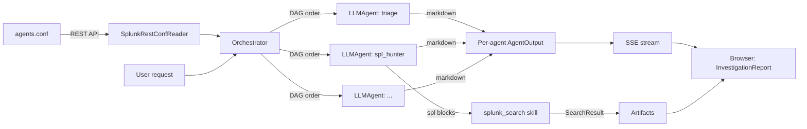

# Splunk Agent Mesh — Architecture

## Current Repo Structure

```
splunk-hackathon/
├── packages/
│   ├── agent-mesh-ui/                # @splunk/agent-mesh-ui — React component library
│   │   ├── src/
│   │   │   ├── Investigations.tsx          # Root app component (top-level tab nav)
│   │   │   ├── types.ts                    # AgentDescriptor, AgentOutput, InvestigationResult, Artifact
│   │   │   ├── pages/
│   │   │   │   ├── InvestigationPage.tsx   # Input card + async job launch + SSE streaming
│   │   │   │   ├── SettingsPage.tsx
│   │   │   │   └── AboutPage.tsx
│   │   │   ├── components/
│   │   │   │   ├── InvestigationReport.tsx # Report layout — sections per agent, artifacts grouped by agent
│   │   │   │   ├── ArtifactRenderer.tsx    # Search artifacts → Column/Line/Pie/Bar/Table viz
│   │   │   │   ├── MarkdownView.tsx        # react-markdown + sanitize
��   │   │   │   ├── AgentStatusBadge.tsx
│   │   │   │   ├── AgentTabsPanel.tsx      # Legacy — unused, superseded by InvestigationReport
│   │   │   │   └── legacy/                 # Archived structured-output components
│   │   │   ├── services/apiClient.ts       # Fetch wrapper + SSE EventSource streaming
│   │   │   └── demo/demoData.ts            # Per-agent canned markdown for demo mode
│   │   └── ...
│   └── agent-mesh/                   # @splunk/agent-mesh — Splunk app bundle
│       ├── src/main/
│       │   ├── webapp/pages/Investigations/    # Webpack entry — mounts <Investigations />
│       │   └── resources/splunk/
│       │       ├── default/
│       │       │   ├── app.conf
│       │       │   ├── agents.conf             # Agent mesh definition (7 SOC agents)
│       │       │   └── data/ui/{nav,views}/
│       │       ├── README/agents.conf.spec     # Splunk spec for agents.conf
│       │       └── lookups/                    # Sample CSV data
├── server/
│   └── agent_mesh/                   # Python FastAPI backend
│       ├── app.py                          # FastAPI routes + SSE stream endpoint
│       ├── config.py                       # Env-driven config
│       ├── conf_reader.py                  # SplunkRestConfReader + FileConfReader
│       ├── job_store.py                    # In-memory async job manager (ThreadPoolExecutor)
│       ├── investigation_models.py         # Result shape helpers (markdown_section, audit_event)
│       ├── request_context.py              # Per-request context (username, splunk_token)
│       ├── settings_store.py               # Credential storage abstraction
│       ├── security.py                     # Redaction + URL/model validators
│       ├── splunk_client.py                # Live Splunk search client (search jobs API)
│       ├── llm/                            # LLM provider adapters
│       │   ├── base.py
│       │   ├── anthropic_provider.py
│       │   ├── openrouter_provider.py
│       │   └── openai_compatible_provider.py
│       ├── agents/
│       │   ├── agent_config.py             # AgentConfig dataclass (skills, depends_on)
│       │   ├── llm_agent.py                # Generic LLM-backed agent
│       │   └── orchestrator.py             # DAG execution, skill dispatch, artifact collection
│       ├── tools/
│       │   └── splunk_search.py            # SPL extraction, execution, viz inference
│       └── demo/demo_case.py               # Per-agent canned markdown
└── docs/
    ├── PROJECT_BRIEF.md / DECISIONS.md / AGENT_DESIGN.md / ...
    └── legacy/heuristics.md                # Archived pre-pivot heuristics
```

## Conceptual Model

Splunk Agent Mesh is a generic agentic platform. An "agent" is a stanza in `agents.conf` plus a system prompt. The runtime ships one generic agent class.



### Execution model

The Orchestrator builds a DAG from `depends_on` edges and executes agents in topological order. Agents at the same depth level run sequentially (parallel execution is architecturally possible but not yet implemented). Dependent agents receive prior agents' markdown and artifact metadata as additional context.

### Skills

Agents declare skills in their stanza (`skills = splunk_search`). After an agent completes, the orchestrator checks its skills and post-processes the output:

- **`splunk_search`**: Extracts fenced SPL blocks from the agent's markdown, executes each against Splunk via the search jobs API, and attaches results as structured artifacts with visualization metadata.

### Visualization inference

The viz type is determined by priority:
1. **Agent hint** — fence tag suffix (e.g., `spl_column` → timechart)
2. **SPL command** — presence of `timechart` in the query
3. **Data shape** — field types and row count heuristics
4. **Fallback** — table

## Frontend Architecture

**Framework**: React 18 + TypeScript
**UI**: `@splunk/react-ui` v5, styled-components, `@splunk/themes`
**Visualizations**: `@splunk/visualizations` (Column, Line, Pie) for chart artifacts
**Markdown**: `react-markdown` + `remark-gfm` + `rehype-sanitize`

The component library is `@splunk/agent-mesh-ui`. The Splunk app `@splunk/agent-mesh` is a thin wrapper that mounts `<Investigations />` via `@splunk/react-page`.

Top-level navigation: three tabs (Investigation / Settings / About) in the root `Investigations` component.

### Investigation flow

1. User fills in the investigation form and clicks Start.
2. `InvestigationPage` calls `POST /api/v1/investigations/start` (returns immediately with an ID).
3. The page connects to `GET /api/v1/investigations/{id}/stream` (SSE).
4. As each agent completes, the server emits an `agent_complete` event; the UI renders that agent's section progressively.
5. On stream completion, the page fetches the full investigation (including artifacts) and renders charts/tables inline.

### Component hierarchy

```
Investigations
└── InvestigationPage
    ├── FormCard (input fields + buttons)
    └── InvestigationReport
        ├── ReportHeader (id, status, owner)
        └── per agent:
            ├── SectionHeader + AgentStatusBadge
            ├── MarkdownView (agent markdown)
            └── ArtifactRenderer × N (search results as charts/tables)
```

## Backend Architecture

**Framework**: Python FastAPI on uvicorn, port 8765.
**Conf source**: `SplunkRestConfReader` calls `/servicesNS/nobody/splunk-agent-mesh/configs/conf-agents` to read agent stanzas. Falls back to `FileConfReader` when `SPLUNK_TOKEN` is absent.
**Job execution**: `InvestigationJobStore` manages async investigations in a thread pool, with SSE streaming of progress events.

### Conf reading

1. Backend calls Splunk REST: `GET /servicesNS/nobody/splunk-agent-mesh/configs/conf-agents?output_mode=json&count=0`.
2. Filters entries whose name starts with `agent:`.
3. Merges the `[default]` stanza into each agent's content.
4. Builds an `AgentConfig` per enabled stanza (including `skills` and `depends_on`).
5. Returns the list sorted by `order` (then by id).

### Agent execution

`LLMAgent.run(request)` builds two messages:
- `system` = the stanza's `system_prompt`.
- `user` = a stable rendering of the user's request fields (plus dependency context if applicable).

Calls `LLMProvider.complete(messages, model, temperature, max_tokens)`. On success, returns `{status: completed, markdown, model, started_at, completed_at}`. On exception, returns `{status: error, error, markdown: "_Agent failed: ..._"}`. One agent failing never sinks the mesh.

### Skill execution (post-agent)

After an agent completes, the orchestrator checks `cfg.skills`:
1. If `splunk_search` is in skills, extracts fenced SPL blocks from markdown.
2. For each block (max 4), calls `SplunkClient.run_search(spl, earliest, latest)`.
3. Wraps results into artifact dicts with fields, rows, visualization metadata.
4. Artifacts are attached to the investigation result and streamed to the UI.

### SSE streaming

The `/api/v1/investigations/{id}/stream` endpoint uses Server-Sent Events:
- `agent_order` — emitted once with the full agent execution list
- `agent_complete` — emitted per agent with its output
- `complete` — emitted when all agents finish

## How React Talks to Backend

Inside Splunk Web, the React app sends JSON API requests through the
Splunk-authenticated `agent_mesh_bridge` custom REST endpoint. Splunk Web
proxies those requests under `/<locale>/splunkd/__raw/services/...`; the bridge
forwards them to `http://127.0.0.1:8765/api/v1` with the authenticated Splunk
username and session key. Direct uvicorn calls remain available for explicit
development use.

The SSE stream connects directly to uvicorn with a short-lived signed stream
token returned by `/investigations/start`.

Endpoints:
- `GET /api/v1/health`
- `GET /api/v1/agents` → `{ agents: AgentDescriptor[] }`
- `GET /api/v1/settings`
- `POST /api/v1/settings`
- `POST /api/v1/settings/test`
- `DELETE /api/v1/settings/credentials`
- `POST /api/v1/investigations/run` (synchronous, blocks)
- `POST /api/v1/investigations/start` (async, returns ID)
- `GET /api/v1/investigations/{id}/status`
- `GET /api/v1/investigations/{id}/stream` (SSE)
- `POST /api/v1/investigations/{id}/cancel`

All `fetch` calls use `AbortController` with timeouts (30s default, 120s for investigation runs, 5s for health).

## How Backend Talks to Splunk

- **Conf reading**: `SplunkRestConfReader` reads agent stanzas via REST.
- **Search execution**: `SplunkClient` submits searches with the delegated user's
  Splunk session key, emits the SID, polls for completion, and returns final
  field/row results to the harness for the next LLM turn.
- **Browser chart data**: React polls `results_preview` and `results` through
  Splunk Web's authenticated `splunkd/__raw` proxy using `@splunk/splunk-utils`.
- **Credential storage**: `SplunkSecureSettingsStore` (Passwords API) — stubbed, using `DevSettingsStore` in current deployment.

## How Backend Talks to LLM Providers

All LLM calls go through the `LLMProvider` base interface (`complete(messages, model, temperature, max_tokens)`). The active provider is selected from settings. API keys are retrieved from the secure store at request time, never cached in memory beyond the request.

## Known Risks

1. **CORS**: FastAPI backend needs CORS configured for Splunk Web origin. Default allowlist includes `http://localhost:8000`.
2. **Backend auth**: MVP has no per-request auth on the backend. Production should validate Splunk session tokens.
3. **LLM latency**: Each agent is a synchronous LLM call. With 7 agents sequential, a full run can take 30-60s. The SSE streaming mitigates perceived latency by showing results progressively.
4. **Splunk REST availability**: If the Splunk REST API is unreachable, `SplunkRestConfReader.get_agents()` logs an error and returns `[]`. The UI shows an empty-mesh state.
5. **Secret storage**: `DevSettingsStore` refuses plaintext unless `AGENT_MESH_DEV_MODE=1`. Production uses Splunk Passwords API.
6. **Markdown sanitization**: All agent output is sanitized via `rehype-sanitize` before render. Agents cannot inject HTML/JS.
