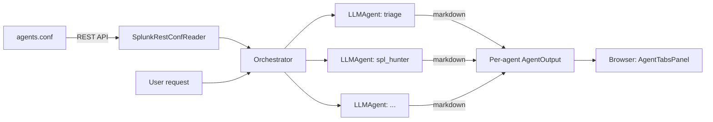

# Splunk Agent Mesh — Architecture

## Current Repo Structure

```
splunk-hackathon/
├── packages/
│   ├── agent-mesh-ui/                # @splunk/agent-mesh-ui — React component library
│   │   ├── src/
│   │   │   ├── Investigations.tsx          # Root app component (top-level tab nav)
│   │   │   ├── types.ts                    # AgentDescriptor, AgentOutput, InvestigationResult
│   │   │   ├── pages/
│   │   │   │   ├── InvestigationPage.tsx   # Input card + AgentTabsPanel
│   │   │   │   ├── SettingsPage.tsx
│   │   │   │   └── AboutPage.tsx
│   │   │   ├── components/
│   │   │   │   ├── MarkdownView.tsx        # react-markdown + sanitize + pluggable code-block renderers
│   │   │   │   ├── AgentTabsPanel.tsx      # Dynamic tabs, one per configured agent
│   │   │   │   ├── AgentStatusBadge.tsx
│   │   │   │   └── legacy/                 # Archived structured-output components
│   │   │   ├── services/apiClient.ts       # Fetch wrapper with timeouts
│   │   │   └── demo/demoData.ts            # Per-agent canned markdown for demo mode
│   │   └── ...
│   └── agent-mesh/                   # @splunk/agent-mesh — Splunk app bundle
│       ├── src/main/
│       │   ├── webapp/pages/Investigations/    # Webpack entry — mounts <Investigations />
│       │   └── resources/splunk/
│       │       ├── default/
│       │       │   ├── app.conf
│       │       │   ├── agents.conf             # Agent mesh definition
│       │       │   └── data/ui/{nav,views}/
│       │       ├── README/agents.conf.spec     # Splunk spec for agents.conf
│       │       └── lookups/                    # Sample CSV data
├── server/
│   └── agent_mesh/                   # Python FastAPI backend
│       ├── app.py                          # FastAPI routes
│       ├── config.py                       # Env-driven config
│       ├── conf_reader.py                  # SplunkRestConfReader + FileConfReader
│       ├── settings_store.py               # Credential storage abstraction
│       ├── security.py                     # Redaction + URL/model validators
│       ├── splunk_client.py                # Splunk search client (stub)
│       ├── llm/                            # LLM provider adapters
│       │   ├── base.py
│       │   ├── anthropic_provider.py
│       │   ├── openrouter_provider.py
│       │   └── openai_compatible_provider.py
│       ├── agents/
│       │   ├── agent_config.py             # AgentConfig dataclass
│       │   ├── llm_agent.py                # Generic LLM-backed agent
│       │   └── orchestrator.py             # Reads conf, runs agents
│       └── demo/demo_case.py               # Per-agent canned markdown
└── docs/
    ├── PROJECT_BRIEF.md / DECISIONS.md / AGENT_DESIGN.md / ...
    └── legacy/heuristics.md                # Archived pre-pivot heuristics
```

## Conceptual Model

Splunk Agent Mesh is a generic agentic platform. An "agent" is a stanza in `agents.conf` plus a system prompt. The runtime ships one generic agent class.



Each agent receives only the original user request. Agents do not see each other's outputs. The Orchestrator runs them sequentially in `order`, collects their markdown outputs into a flat dict, and returns a single response.

## Frontend Architecture

**Framework**: React 18 + TypeScript
**UI**: `@splunk/react-ui` v5, styled-components, `@splunk/themes`
**Markdown**: `react-markdown` + `remark-gfm` + `rehype-sanitize`

The component library is `@splunk/agent-mesh-ui`. The Splunk app `@splunk/agent-mesh` is a thin wrapper that mounts `<Investigations />` via `@splunk/react-page`.

Top-level navigation: three tabs (Investigation / Settings / About) in the root `Investigations` component.

The Investigation view layout: input card on top, `AgentTabsPanel` below. The tabs panel pre-fetches `/api/v1/agents` so the user sees the configured mesh before any run.

### Rendering and extensibility

`MarkdownView` accepts a `codeBlockRenderers` registry keyed by language tag. v1 leaves it empty so all code blocks fall through to plain `<code>`. When skills land (` ```spl `, ` ```splunk-chart `, ` ```splunk-table `), the renderer registry takes over for those language tags without changing the agent contract.

## Backend Architecture

**Framework**: Python FastAPI on uvicorn, port 8765.
**Conf source**: `SplunkRestConfReader` calls `/servicesNS/nobody/splunk-agent-mesh/configs/conf-agents` to read agent stanzas. Falls back to `FileConfReader` when `SPLUNK_TOKEN` is absent.
**Auth**: Uses a Splunk admin token (env var `SPLUNK_TOKEN`) for REST calls in v1. Per-request session-token forwarding is a future improvement.

### Conf reading

1. Backend calls Splunk REST: `GET /servicesNS/nobody/splunk-agent-mesh/configs/conf-agents?output_mode=json&count=0`.
2. Filters entries whose name starts with `agent:`.
3. Merges the `[default]` stanza into each agent's content.
4. Builds an `AgentConfig` per enabled stanza.
5. Returns the list sorted by `order` (then by id).

### Agent execution

`LLMAgent.run(request)` builds two messages:
- `system` = the stanza's `system_prompt`.
- `user` = a stable rendering of the user's request fields.

Calls `LLMProvider.complete(messages, model, temperature, max_tokens)`. On success, returns `{status: completed, markdown, model, started_at, completed_at}`. On exception, returns `{status: error, error, markdown: "_Agent failed: ..._"}`. One agent failing never sinks the mesh.

## How React Talks to Backend

The React app calls `http://localhost:8765/api/v1` via `apiClient.ts`. The base URL can be overridden by setting `window.__AGENT_MESH_API_URL__` in the Splunk page template.

Endpoints:
- `GET /api/v1/health`
- `GET /api/v1/agents` → `{ agents: AgentDescriptor[] }`
- `GET /api/v1/settings`
- `POST /api/v1/settings`
- `POST /api/v1/settings/test`
- `DELETE /api/v1/settings/credentials`
- `POST /api/v1/investigations/run`

All `fetch` calls are wrapped in `AbortController` with 30s default timeout (120s for investigation runs, 5s for health).

## How Backend Talks to Splunk

The same Splunk REST credentials used for `SplunkRestConfReader` will eventually power `SplunkSecureSettingsStore` (passwords API) and `SplunkClient` (search jobs API). v1 has the conf reader wired; the other two are stubs awaiting Phase 3.

## How Backend Talks to LLM Providers

All LLM calls go through the `LLMProvider` base interface (`complete(messages, model, temperature, max_tokens)`). The active provider is selected from settings. API keys are retrieved from the secure store at request time, never cached in memory beyond the request.

## Secure Credential Flow

```
Settings Page → POST /settings (provider, model, base_url, api_key)
             → Backend validates and strips api_key
             → Stores provider/model/base_url in settings.conf
             → Stores api_key in Splunk Passwords API (encrypted at rest)

GET /settings → Backend returns provider/model/base_url + api_key_configured: true/false
             → api_key is NEVER returned

POST /investigations/run → Backend retrieves api_key from secure store
                        → Uses it for LLM calls in-process
                        → api_key is NOT logged, NOT included in response
```

## Known Risks

1. **CORS**: FastAPI backend needs CORS configured for Splunk Web origin. Default allowlist includes `http://localhost:8000`.
2. **Backend auth**: MVP has no per-request auth on the backend. Production should validate Splunk session tokens.
3. **LLM latency**: Each agent is a synchronous LLM call. With 7 agents sequential, a full run can take 30-60s. Parallel execution and streaming are deferred improvements.
4. **Splunk REST availability**: If the Splunk REST API is unreachable, `SplunkRestConfReader.get_agents()` logs an error and returns `[]`. The UI shows an empty-mesh state.
5. **Secret storage**: `DevSettingsStore` refuses plaintext unless `AGENT_MESH_DEV_MODE=1`. Production uses Splunk Passwords API (Phase 3.1).
6. **Markdown sanitization**: All agent output is sanitized via `rehype-sanitize` before render. Agents cannot inject HTML/JS.
