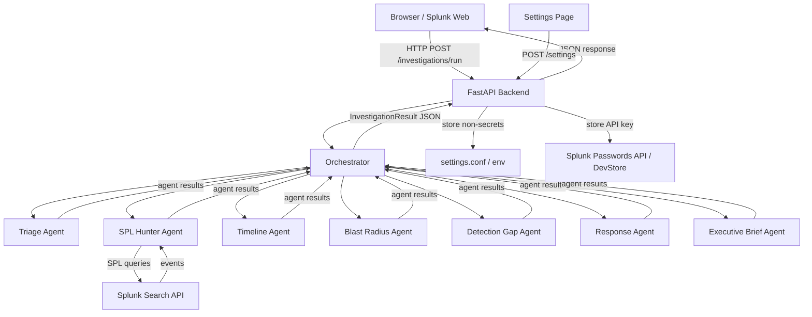

# Splunk Agent Mesh — Architecture

## Current Repo Structure

```
splunk-hackathon/
├── packages/
│   ├── investigations/           # @splunk/agent-mesh-ui — React component library
│   │   ├── src/
│   │   │   ├── Investigations.tsx       # Root app component (tab nav)
│   │   │   ├── InvestigationsStyles.ts
│   │   │   ├── index.ts
│   │   │   ├── types.ts                 # Shared TypeScript types
│   │   │   ├── pages/
│   │   │   │   ├── InvestigationPage.tsx
│   │   │   │   ├── SettingsPage.tsx
│   │   │   │   └── AboutPage.tsx
│   │   │   ├── components/
│   │   │   │   ├── AgentRunPanel.tsx
│   │   │   │   ├── InvestigationSummary.tsx
│   │   │   │   ├── IncidentTimeline.tsx
│   │   │   │   ├── EntityGraphPlaceholder.tsx
│   │   │   │   ├── EvidenceTable.tsx
│   │   │   │   ├── DetectionRecommendation.tsx
│   │   │   │   └── ResponsePlan.tsx
│   │   │   ├── services/
│   │   │   │   └── apiClient.ts         # HTTP client for backend
│   │   │   └── demo/
│   │   │       └── demoData.ts          # Static demo investigation result
│   │   └── ...
│   └── splunk-agent-mesh/          # @splunk/agent-mesh — Splunk app bundle
│       ├── src/main/
│       │   ├── webapp/pages/
│       │   │   └── Investigations/      # Webpack entry point
│       │   │       ├── index.tsx        # Mounts <Investigations /> via @splunk/react-page
│       │   │       └── Styles.ts
│       │   └── resources/splunk/        # Splunk app staging artifacts
│       │       ├── appserver/templates/ # Mako HTML templates
│       │       ├── default/
│       │       │   ├── app.conf
│       │       │   ├── data/ui/
│       │       │   │   ├── nav/default.xml
│       │       │   │   └── views/Investigations.xml
│       │       │   └── savedsearches.conf
│       │       └── lookups/             # Sample data CSVs for demo
├── server/
│   └── agent_mesh/            # Python FastAPI backend
│       ├── app.py                # FastAPI app + routes
│       ├── config.py
│       ├── security.py           # Credential redaction helpers
│       ├── settings_store.py     # Settings/credential storage abstraction
│       ├── splunk_client.py      # Splunk search client
│       ├── llm/                  # LLM provider adapters
│       │   ├── base.py
│       │   ├── anthropic_provider.py
│       │   ├── openrouter_provider.py
│       │   └── openai_compatible_provider.py
│       ├── agents/               # Agent orchestration
│       │   ├── orchestrator.py
│       │   ├── triage_agent.py
│       │   ├── spl_hunter_agent.py
│       │   ├── timeline_agent.py
│       │   ├── blast_radius_agent.py
│       │   ├── detection_gap_agent.py
│       │   ├── response_agent.py
│       │   └── executive_brief_agent.py
│       └── demo/
│           ├── demo_case.py
│           └── synthetic_events.py
├── splunk/
│   ├── spl/                      # Example SPL detections (reference)
│   └── config_examples/          # Splunk config examples (not auto-installed)
└── docs/
```

## Frontend Architecture

**Framework**: React 18 + TypeScript  
**UI Components**: `@splunk/react-ui` v5 (buttons, tables, panels, inputs, tabs, badges)  
**Styling**: styled-components v5 + `@splunk/themes` variables  
**Build**: Webpack via `@splunk/webpack-configs`, bundled into Splunk app static assets  
**Navigation**: Tab-based navigation in the root `Investigations` component (no React Router needed for MVP — avoids Splunk URL routing conflicts)

The `@splunk/agent-mesh-ui` package is the component library. All UI logic lives here. The `@splunk/agent-mesh` package is purely the Splunk app wrapper that mounts the component into Splunk Web.

## Backend Architecture

**Framework**: Python FastAPI  
**Run mode (MVP)**: Standalone service on localhost:8000, proxied or called directly from the React frontend  
**Future integration**: Package as a Splunk custom REST handler in `appserver/` so the backend runs within Splunk's Python environment

### Why FastAPI for MVP
- Fast to develop and test outside Splunk
- Clean async support
- Easy to document and test with OpenAPI UI
- Path to Splunk integration: Splunk Custom REST Handler wrapping the same Python logic

## Data Flow



## How React Talks to Backend

In MVP, the React frontend makes direct HTTP calls to `http://localhost:8000/api/v1` via `apiClient.ts`. The base URL is configurable.

For Splunk integration, the backend will be exposed via Splunk's REST proxy at `/en-US/splunkd/services/agent_mesh/...`, and the API client will use relative URLs.

## How Backend Talks to Splunk

`splunk_client.py` wraps the Splunk REST API (`/services/search/jobs`) using the `splunk-sdk-python` or direct HTTP calls with session key auth. For demo/MVP, Splunk calls are stubbed with synthetic data.

## How Backend Talks to LLM Providers

All LLM calls go through the `LLMProvider` base interface. The active provider is selected from settings. API keys are retrieved from the secure store at request time, never cached in memory beyond the request.

## Secure Credential Flow

```
Settings Page → POST /settings (provider, model, base_url, api_key)
             → Backend validates and strips api_key
             → Stores provider/model/base_url in settings.conf
             → Stores api_key in Splunk Passwords API (encrypted at rest)
             
GET /settings → Backend returns provider/model/base_url + api_key_configured: true/false
             → api_key is NEVER returned

POST /investigations/run → Backend retrieves api_key from secure store
                        → Uses it for LLM calls in-process
                        → api_key is NOT logged, NOT included in response
```

## Known Risks

1. **CORS**: FastAPI backend needs CORS configured for Splunk Web origin. Configured in `app.py`.
2. **Auth**: MVP has no auth on the backend. In production, validate Splunk session tokens.
3. **Rate limiting**: LLM API calls can be slow. MVP uses deterministic stubs. Add timeouts.
4. **Splunk search latency**: Real SPL searches can take 10+ seconds. Add async/polling in v2.
5. **Secret storage**: MVP DevSettingsStore refuses plaintext unless `AGENT_MESH_DEV_MODE=1`. Production uses Splunk Passwords API.
